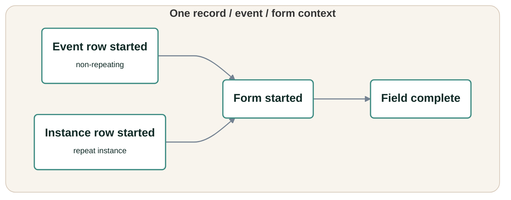

---
output:
  github_document:
    md_extensions: -smart
---

<!-- README.md is generated from README.Rmd. Please edit that file -->

```{r setup, include = FALSE}
options(width = 120)
knitr::opts_chunk$set(
  collapse = TRUE,
  comment = "#>"
)
```

# redcapmissing

<!-- badges: start -->


<!-- badges: end -->

`redcapmissing` builds branching-aware missingness reports for REDCap record
exports. It combines `redcapAPI` project metadata with typed REDCap exports so
missing values, absent event rows, absent repeat instances, blank forms, and
field-specific gaps stay separate in the report.

<p align="center">
  
</p>

## Installation

`redcapmissing` requires R 4.1.0 or later. Install the current GitHub version
with:

```r
# install.packages("pak")
pak::pak("blankuzr/redcapmissing")
```

## REDCap inputs

In production workflows, create a `redcapAPI::redcapConnection()` object and
export records with `redcapAPI::exportRecordsTyped()`. Use coded values for
branching-logic fields and raw values for checkbox and system fields:

```r
records <- redcapAPI::exportRecordsTyped(
  rcon,
  cast = list(
    radio = redcapAPI::castCode,
    dropdown = redcapAPI::castCode,
    yesno = redcapAPI::castCode,
    truefalse = redcapAPI::castCode,
    checkbox = redcapAPI::castRaw,
    system = redcapAPI::castRaw
  )
)
```

## Validation model

`redcapmissing` uses four validation checks at the event/form context. Failed
checks remove that record/event/repeat/form context from every downstream
check. The registry validation-level is written
`event:form / event:form:instance` because emitted report rows resolve to
`event:form` when the requested form is assessed in a non-repeating event
context and `event:form:instance` when it is assessed in a repeat-instance
context.



| validation_level | validation_check | Meaning |
|---|---|---|
| event:form / event:form:instance | `event-row-started` | The expected REDCap event row exists in the export. |
| event:form / event:form:instance | `instance-row-started` | The expected REDCap repeat instance row exists in the export. |
| event:form / event:form:instance | `form-started` | The exported form context has at least one entered data-capturing field. |
| event:form / event:form:instance | `field-complete` | field complete |

Call `redcapmissing::registry()` to inspect the package registry that drives
this model:

```{r, eval = FALSE}
redcapmissing::registry()
```

## Minimal workflow

The example below uses a synthetic connection-like object so it can run without
live REDCap credentials. In routine use, replace `rcon` and `records` with a
real `redcapAPI::redcapConnection()` and typed export. `get_summary(report)`
shows every validation check that ran in this compact example;
`get_missing(report)` shows the failed rows.

```{r, message = FALSE}
library(redcapmissing)

metadata <- tibble::tibble(
  field_name = c("record_id", "branch_flag", "required_note", "conditional_note"),
  form_name = "baseline_form",
  field_type = c("text", "yesno", "text", "text"),
  field_label = c("Record ID", "Branch flag", "Required note", "Conditional note"),
  select_choices_or_calculations = "",
  text_validation_type_or_show_slider_number = "",
  branching_logic = c("", "", "", "[branch_flag] = '1'"),
  required_field = c("y", "y", "y", "y")
)

rcon <- list(
  metadata = function() metadata,
  instruments = function() tibble::tibble(
    instrument_name = "baseline_form",
    instrument_label = "Baseline form"
  )
)

records <- tibble::tibble(
  record_id = c("r1", "r2"),
  branch_flag = c("1", "0"),
  required_note = c("entered", "entered"),
  conditional_note = c("", "")
)

report <- find_missing(
  data = records,
  rcon = rcon,
  forms = "baseline_form"
)

check_summary <- get_summary(report)
check_summary_rows <- as.data.frame(check_summary[
  check_summary$assessed > 0,
  c(
    "validation_level",
    "validation_check",
    "assessed",
    "failed"
  )
])
print(check_summary_rows, row.names = FALSE)

missing_view <- get_missing(
  report,
  validation_check = "field-complete"
)
failed_rows <- as.data.frame(missing_view[
  ,
  c(
    "record_id",
    "validation_context",
    "form",
    "validation_check",
    "field_name"
  )
])
print(failed_rows, row.names = FALSE)
```

## Report outputs

`find_missing()` returns a `"redcapmissing"` report with compact internal
summary and failure tables, normalized project context in `report$spec`,
timing and row counts in `report$diagnostics`, and optional row-level details.
Use the documented accessors instead of depending on the wider internal
tables:

```r
get_summary(
  report,
  validation_check = NULL,
  events = NULL,
  forms = NULL
)

get_missing(
  report,
  validation_check = NULL,
  events = NULL,
  forms = NULL
)
```

`NULL` keeps all values for a filter; otherwise it must be a nonempty character
vector without `NA`, blank, or whitespace-only entries. Values are raw and
case-sensitive. Duplicate filter values are treated as a set, multiple filters
are applied by intersection, and stored row order is preserved. Validation
checks are validated against
`registry()`; events and forms are validated against the report's configured
scope, even when that context has no failed rows. Invalid or unknown values are
errors. A valid filter, or valid filter intersection, with no result rows
returns a correctly typed zero-row tibble. Filters only subset the completed
report; they never recompute denominators. There is no accessor `instances`
argument: `find_missing(instances = ...)` declares expected repeat contexts,
while exact instances can be filtered from `redcap_repeat_instance` afterward.

`get_summary()` always returns these 11 columns:

```text
redcap_event_name, form,
redcap_repeat_instrument, redcap_repeat_instance,
validation_level, validation_check,
assessed, passed, failed, pass_rate, fail_rate
```

The context and validation columns are character, counts are integer, and
rates are double. `get_missing()` always returns these 12 character columns:

```text
record_id,
redcap_event_name, redcap_repeat_instrument, redcap_repeat_instance,
validation_context, form, validation_check,
field_name, field_label, field_type, branching_logic, url
```

Both schemas keep `redcap_event_name`, `redcap_repeat_instrument`, and
`redcap_repeat_instance`, including for non-longitudinal, non-repeating, and
zero-row results. Inapplicable context is represented by `""`. This makes
post-accessor filtering by event, record, form, validation check, or repeat
instance predictable without changing any stored calculation:

```{r, eval = FALSE}
field_summary <- get_summary(
  report,
  validation_check = "field-complete"
)

missing_subset <- get_missing(report)
missing_subset <- missing_subset[
  missing_subset$record_id == "r1",
  c("record_id", "form", "field_name", "url")
]
```

Accessor results carry a `redcapmissing_labels` attribute with the report's
event and form labels for presentation. The data columns remain raw REDCap
values. If a later manipulation removes the attribute, formatters fall back to
those raw values.

## Formatted outputs

`flexify(x)` accepts a tibble returned by `get_summary()` or `get_missing()`.
It has no filtering or formatting arguments: filter rows with an accessor or
ordinary tibble operations, and select columns before calling it. Any nonempty
column subset, in any order, is supported when all columns belong to one of the
two accessor schemas; shared-only selections such as `form` and
`validation_check` work too. Added or renamed columns, changed storage types,
and mixtures of summary-only with missing-only columns are rejected.

```{r, eval = FALSE}
summary_table <- flexify(field_summary)
missing_table <- flexify(missing_subset)

compact_summary <- get_summary(report)[
  ,
  c("form", "validation_check", "failed", "fail_rate")
]
compact_table <- flexify(compact_summary)

flex_html(summary_table)
```

`flexify()` preserves input row and column order and displays one output column
per supplied input column. It applies friendly headers, registry validation
labels, event/form labels when their metadata remain available, one-decimal
percentage formatting for rate columns, blank display for `NA`, and hyperlinks
for available URLs. If both repeat columns are supplied and both are entirely
blank, it suppresses that pair visually when another display column remains;
the input tibble is unchanged.

Version 6.0 removes `tidy()`, `tidy.redcapmissing()`, and the old report-input
`flex()` helper, along with the `generics` dependency. Use `get_summary()` for
summary rows and compose either accessor with `flexify()` for flextable output.

`flex_event_forms(report)` remains the specialized reduced event/form table.
It returns an `All` summary row, event and repeat-instance started/due counts,
and three form-opportunity metrics. Each form row uses the exact row-started
assessed N for its context:
`event-row-started` for non-repeat longitudinal rows, `instance-row-started`
for repeat rows, and `Total N` for the display-only non-longitudinal
`Single event` row. Forms under the same event can therefore have different
assessed Ns when final record eligibility differs because of `records`, event
selection, or repeat context.

- `Form Incomplete` counts each record context once when any applicable
  `event-row-started`, `instance-row-started`, `form-started`, or
  `field-complete` check fails. Multiple missing fields in one context still
  count once.
- `Form Not Started` counts each record context once when an applicable
  `event-row-started`, `instance-row-started`, or `form-started` check fails.
- `Form >10% Missing` treats a failed start check as 100% missing. Otherwise,
  it uses failed divided by assessed `field-complete` checks. A started form
  with no applicable field checks has a 0% effective missing fraction. Below
  `1`, the comparison is strict and unrounded, so exactly 10% does not count at
  the default. At `missing_threshold = 1`, the heading becomes
  `Form = 100% Missing` and contexts with 100% effective missingness count.
  Other headings print the cutoff without unnecessary trailing zeros, so
  `missing_threshold = 0.125` produces `Form >12.5% Missing`.

`Form Incomplete` is displayed as N (%) on form rows and N/D (%) on the `All`
row. `Form Not Started` and the dynamic threshold column display N/D (%) on
both. The `All` row sums shown form opportunities rather than deduplicating
records across forms. Repeat form rows show started/due counts in the N column,
while non-repeat form rows leave that cell blank. Reports created before
`redcapmissing` 5.2.0 must be regenerated with `find_missing()`:

```{r, eval = FALSE}
flexify(get_summary(report, validation_check = "field-complete"))
flexify(get_missing(report, validation_check = "field-complete"))
flex_event_forms(report)
flex_event_forms(report, missing_threshold = 0.125)
```

## Events, records, and repeats

Use `events` to keep a multi-event form on only selected REDCap events. Use
`records` when only certain record IDs should be checked for selected events,
forms, or repeat instances. Use `instances` to declare expected repeat
instances when REDCap would otherwise omit nonexistent repeat rows from the
export.

`records` is a named list keyed by raw `redcap_event_name`. An event-level
vector limits every final requested form and selected repeat instance at that
event. A nested form vector limits one event/form context. A nested instance
list limits one event/form/repeat-instance context. Omitted event, form, and
instance entries use the default eligibility implied by `data`, `forms`,
`events`, `instances`, and `ignore_ids`. Empty, missing, `NULL`, and blank-only
record values are errors. To remove an event from assessment entirely, exclude
it with `events` rather than using an empty `records` entry.

Every report stores `spec$record_eligibility` with one row for each final
assessed record/event/form/repeat-instance context, even when `records` is
omitted. If filtering leaves no assessable record IDs, `find_missing()` stops.
Explicit `records` entries are the exception because they can declare expected
contexts whose absent data rows should fail a row-started check.

```{r, eval = FALSE}
staged_report <- find_missing(
  data = typed_records,
  rcon = rcon,
  forms = c("surgery", "demographics"),
  records = list(
    event_a_arm_1 = c("record_a", "record_b"),
    event_b_arm_1 = c("record_a", "record_b"),
    event_c_arm_1 = list(
      surgery = "record_b",
      demographics = c("record_a", "record_b")
    )
  )
)
```

With this call, `event_a_arm_1` and `event_b_arm_1` are limited to `record_a`
and `record_b` for every assessed form at those events. On `event_c_arm_1`,
`surgery` is limited to `record_b`, while `demographics` is limited to
`record_a` and `record_b`. If `demographics` is also offered on
`event_d_arm_1` and `event_d_arm_1` is not excluded with `events`, then
`records` does not limit that event.

For a repeating form, declare the expected repeat instances after exporting
records and creating the REDCap connection object:

```{r, eval = FALSE}
repeat_report <- find_missing(
  data = typed_records,
  rcon = rcon,
  forms = "repeat_form",
  instances = 2L
)
```

For forms that are regular on some requested events and repeating on others,
the package activates event/form checks per context: regular event contexts use
`event-row-started`, repeating contexts use `instance-row-started`, and repeat
instances are assessed only when selected by `instances` and final record
eligibility.

See the [package vignette](vignettes/redcapmissing.Rmd#repeat-expectations) for
a runnable synthetic repeat example.

## Learn more

- Run `vignette("redcapmissing", package = "redcapmissing")` after installing
  the package.
- Read the [getting started vignette](vignettes/redcapmissing.Rmd) for a fuller
  synthetic walk-through of branching-aware, repeat-aware, and
  validation-registry-driven missingness reporting.
- Review [NEWS.md](NEWS.md) for user-facing changes by version.
- Report bugs and feature requests in
  [GitHub issues](https://github.com/blankuzr/redcapmissing/issues).

## Development

```r
devtools::document()
devtools::test()
devtools::check()
```
