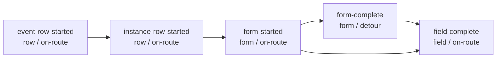

<!-- README.md is generated from README.Rmd. Please edit that file -->

# redcapmissing

<!-- badges: start -->


<!-- badges: end -->


`redcapmissing` builds branching-aware missingness reports for REDCap
record exports. It combines `redcapAPI` project metadata with typed
REDCap exports so missing values, absent event rows, absent repeat
instances, blank forms, and field-level gaps stay separate in the
report.

## Install

``` r
# install.packages("pak")
pak::pkg_install("blankuzr/redcapmissing")
```

## REDCap inputs

In production workflows, create a `redcapAPI::redcapConnection()` object
and export records with `redcapAPI::exportRecordsTyped()`. Use coded
values for branching-logic fields and raw values for checkbox and system
fields:

``` r
records <- redcapAPI::exportRecordsTyped(
  rcon,
  cast = list(
    radio = redcapAPI::castCode,
    dropdown = redcapAPI::castCode,
    yesno = redcapAPI::castCode,
    truefalse = redcapAPI::castCode,
    checkbox = redcapAPI::castRaw,
    system = redcapAPI::castRaw
  )
)
```

## Validation model

`redcapmissing` uses five validation checks. Failed `on-route` checks
remove that record/event/repeat/form context from every downstream
check. The `form-complete` check is a `detour`: it can fail while the
same context still flows into `field-complete`.



| validation_level | validation_check | validation_check_type | Meaning |
|----|----|----|----|
| row | `event-row-started` | `on-route` | The expected REDCap event row exists in the export. |
| row | `instance-row-started` | `on-route` | The expected REDCap repeat instance row exists in the export. |
| form | `form-started` | `on-route` | The exported form context has at least one entered data-capturing field. |
| form | `form-complete` | `detour` | All expected fields are complete for an evaluable form context. |
| field | `field-complete` | `on-route` | A specific expected field is complete after branching and filtering. |

Call `registry()` to inspect the package registry that drives this
model:

``` r
registry()
```

## Minimal workflow

The example below uses a synthetic connection-like object so it can run
without live REDCap credentials. In routine use, replace `rcon` and
`records` with a real `redcapAPI::redcapConnection()` and typed export.

``` r
library(redcapmissing)

metadata <- tibble::tibble(
  field_name = c("record_id", "branch_flag", "required_note", "conditional_note"),
  form_name = "baseline_form",
  field_type = c("text", "yesno", "text", "text"),
  field_label = c("Record ID", "Branch flag", "Required note", "Conditional note"),
  select_choices_or_calculations = "",
  text_validation_type_or_show_slider_number = "",
  branching_logic = c("", "", "", "[branch_flag] = '1'"),
  required_field = c("y", "y", "y", "y")
)

rcon <- list(
  metadata = function() metadata,
  instruments = function() tibble::tibble(
    instrument_name = "baseline_form",
    instrument_label = "Baseline form"
  )
)

records <- tibble::tibble(
  record_id = c("r1", "r2"),
  branch_flag = c("1", "0"),
  required_note = c("entered", "entered"),
  conditional_note = c("", "")
)

report <- find_missing(
  data = records,
  rcon = rcon,
  forms = "baseline_form"
)

report$missing
tidy(report)
flex(report)
```

## Report outputs

`find_missing()` returns a `"redcapmissing"` object centered on an
interrogated `pointblank` agent. Common outputs are:

- `report$missing`: failed rows extracted from `pointblank`
- `report$validation_rows`: all rows supplied to `pointblank`
- `report$event_row_started_failures`,
  `report$instance_row_started_failures`,
  `report$form_started_failures`, `report$form_complete_failures`, and
  `report$field_complete_failures`: check-specific failure tables
- `tidy(report)`: one summary row per validation check and REDCap
  context
- `flex(report)`: a formatted summary table for reporting workflows

`tidy(report)` uses canonical validation columns: `validation_level`,
`validation_check`, and `validation_check_type`. `flex(report)` displays
the same checks with human-readable labels.

## Events and repeats

Use `events` to restrict multi-event forms to selected REDCap events.
Use `instances` to declare expected repeat instances when REDCap would
otherwise omit nonexistent repeat rows from the export.

``` r
repeat_report <- find_missing(
  data = records,
  rcon = rcon,
  forms = "repeat_form",
  instances = 2L
)
```

For forms that are regular on some requested events and repeating on
others, the package activates row-level checks per context: regular
event contexts use `event-row-started`, and repeating contexts use
`instance-row-started`.

## Acknowledgement and citation

### `redcapAPI`

This package relies heavily on `redcapAPI` and would not be practical
without it. If `redcapmissing` contributes to your work, please also
cite `redcapAPI`.

#### Foundational package citation

> Nutter B, Garbett S, Obregon S, Obadia T, Lehr M, High B, Lane S,
> Beasley W, Gray W, Kennedy N, Hsi-Nien T, Horner J, Stephens J, Beck
> C, Johnson B, Chase P, Tobias P (2026). *redcapAPI: Accessing data
> from REDCap projects using the API*. R package version 2.12.0.
> <https://doi.org/10.5281/zenodo.10564837>

#### Current package ownership and maintenance

Current public stewardship appears under VUMC Biostatistics /
`vubiostat`, with Shawn Garbett listed as maintainer in current package
documentation and the upstream project README stating that ownership
transfer to VUMC Biostatistics is complete.

Useful current `redcapAPI` references:

- VUMC Biostatistics redcapAPI project page and abstract by Savannah
  Obregon, Shawn Garbett, and Benjamin Nutter:
  <https://www.vumc.org/biostatistics/node/565>
- Current GitHub repository for the package:
  <https://github.com/vubiostat/redcapAPI>
- Current package site: <https://vubiostat.r-universe.dev/redcapAPI>

### `pointblank`

This package relies on `pointblank` for validating missingness,
standardizing return summaries, and exposing row-level flags.

#### Current package resources

Useful current `pointblank` references:

- R package GitHub repository: <https://github.com/rstudio/pointblank>
- R package site: <https://rstudio.github.io/pointblank/>
- Python package GitHub repository:
  <https://github.com/posit-dev/pointblank>
- Python package site: <https://posit-dev.github.io/pointblank/>

## Learn more

See the package vignette for a fuller synthetic walk-through of
branching-aware, repeat-aware, and validation-registry-driven
missingness reporting.

## Development

``` r
devtools::document()
devtools::test()
devtools::check()
```
