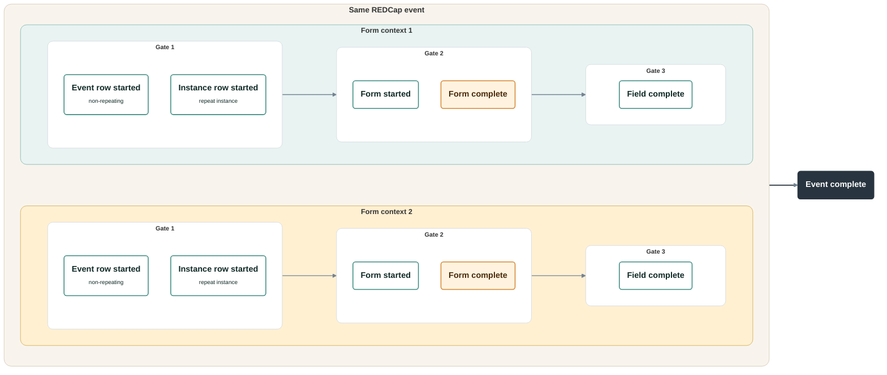

<!-- README.md is generated from README.Rmd. Please edit that file -->

# redcapmissing

<!-- badges: start -->


<!-- badges: end -->

`redcapmissing` builds branching-aware missingness reports for REDCap
record exports. It combines `redcapAPI` project metadata with typed
REDCap exports so missing values, absent event rows, absent repeat
instances, blank forms, and field-specific gaps stay separate in the
report.

<p align="center">


</p>

## Installation

`redcapmissing` requires R 4.1.0 or later. Install the current GitHub
version with:

``` r
# install.packages("pak")
pak::pak("blankuzr/redcapmissing")
```

## REDCap inputs

In production workflows, create a `redcapAPI::redcapConnection()` object
and export records with `redcapAPI::exportRecordsTyped()`. Use coded
values for branching-logic fields and raw values for checkbox and system
fields:

``` r
records <- redcapAPI::exportRecordsTyped(
  rcon,
  cast = list(
    radio = redcapAPI::castCode,
    dropdown = redcapAPI::castCode,
    yesno = redcapAPI::castCode,
    truefalse = redcapAPI::castCode,
    checkbox = redcapAPI::castRaw,
    system = redcapAPI::castRaw
  )
)
```

## Validation model

`redcapmissing` uses six validation checks across two conceptual
validation-levels. Failed `on-route` checks remove that
record/event/repeat/form context from every downstream check. The
event/form validation-level is written
`event:form / event:form:instance` because the emitted report row
resolves to `event:form` when the requested form is assessed in a
non-repeating event context and `event:form:instance` when it is
assessed in a repeat-instance context. The `event` level is a summary
layer. `form-complete` and `event-complete` are `detour` checks: they
report failures without feeding back into the pass-only pipeline.



| validation_level | validation_check | validation_check_type | Meaning |
|----|----|----|----|
| event:form / event:form:instance | `event-row-started` | `on-route` | The expected REDCap event row exists in the export. |
| event:form / event:form:instance | `instance-row-started` | `on-route` | The expected REDCap repeat instance row exists in the export. |
| event:form / event:form:instance | `form-started` | `on-route` | The exported form context has at least one entered data-capturing field. |
| event:form / event:form:instance | `form-complete` | `detour` | all form fields complete |
| event:form / event:form:instance | `field-complete` | `on-route` | field complete |
| event | `event-complete` | `detour` | all forms on event complete |

`event-complete` is computed from the event's `on-route` checks. It does
not count `form-complete` rows because `form-complete` is itself a
`detour`.

Call `redcapmissing::registry()` to inspect the package registry that
drives this model:

``` r
redcapmissing::registry()
```

## Minimal workflow

The example below uses a synthetic connection-like object so it can run
without live REDCap credentials. In routine use, replace `rcon` and
`records` with a real `redcapAPI::redcapConnection()` and typed export.
The summary shows every validation check that ran in this compact
example; `report$missing` shows only the failed rows.

``` r
library(redcapmissing)

metadata <- tibble::tibble(
  field_name = c("record_id", "branch_flag", "required_note", "conditional_note"),
  form_name = "baseline_form",
  field_type = c("text", "yesno", "text", "text"),
  field_label = c("Record ID", "Branch flag", "Required note", "Conditional note"),
  select_choices_or_calculations = "",
  text_validation_type_or_show_slider_number = "",
  branching_logic = c("", "", "", "[branch_flag] = '1'"),
  required_field = c("y", "y", "y", "y")
)

rcon <- list(
  metadata = function() metadata,
  instruments = function() tibble::tibble(
    instrument_name = "baseline_form",
    instrument_label = "Baseline form"
  )
)

records <- tibble::tibble(
  record_id = c("r1", "r2"),
  branch_flag = c("1", "0"),
  required_note = c("entered", "entered"),
  conditional_note = c("", "")
)

report <- find_missing(
  data = records,
  rcon = rcon,
  forms = "baseline_form"
)

check_summary <- tidy(report)
check_summary_rows <- as.data.frame(check_summary[
  check_summary$assessed > 0,
  c(
    "validation_level",
    "validation_check",
    "validation_check_type",
    "assessed",
    "failed"
  )
])
print(check_summary_rows, row.names = FALSE)
#>  validation_level validation_check validation_check_type assessed failed
#>        event:form     form-started              on-route        2      0
#>        event:form    form-complete                detour        2      1
#>        event:form   field-complete              on-route        7      1
#>             event   event-complete                detour        2      1

failed_rows <- as.data.frame(report$missing[
  ,
  c(
    "record_id",
    "validation_level",
    "validation_check_type",
    "validation_check",
    "field_name"
  )
])
print(failed_rows, row.names = FALSE)
#>  record_id validation_level validation_check_type validation_check       field_name
#>         r1       event:form                detour    form-complete             <NA>
#>         r1       event:form              on-route   field-complete conditional_note
#>         r1            event                detour   event-complete             <NA>
```

## Report outputs

`find_missing()` returns a `"redcapmissing"` object centered on a native
validation summary. Common outputs are:

- `report$summary`: compact validation summary used by `tidy(report)`
- `report$missing`: failed validation rows with native `validation_step`
  and `validation_row_id` identifiers
- `report$spec`: normalized forms, events, labels, eligible records,
  instances, ignored fields/IDs, ID column, and REDCap system fields
- `report$diagnostics`: timing and row-count metadata for
  troubleshooting
- `report$details`: `NULL` by default; when `details = TRUE`, contains
  `validation_rows`, `checks`, and `failures`
- `tidy(report)`: one summary row per validation check and REDCap
  context

`tidy(report)` returns raw REDCap event/form context first, followed by
canonical validation columns and pass/fail rates. Repeat instrument and
repeat instance columns are included only when the report contains
repeat contexts. `validation_level` is `event:form`,
`event:form:instance`, or `event`, and `validation_check_type` is
`on-route` or `detour`.

Optional reporting helpers are available for formatted outputs.
`flex(report)` and `flex_event_forms(report)` require `flextable` and
`glue`; `flex_html()` also requires `htmltools`. `flex(report)` displays
labeled event, form, repeat context, validation-check, and pass/fail
columns. Use raw values from `tidy(report)` in `flex(events = ...)`,
`flex(forms = ...)`, and `flex(validation_check = ...)` to subset rows
before display labels are applied. `flex_event_forms(report)` returns a
reduced event/form table with total record N in the N column label,
event row-started passed/assessed counts on event rows, form-complete
counts, and fields-missing counts nested under each event. Repeat form
rows show repeat-instance passed/assessed counts in the N column, while
non-repeat form rows leave that cell blank. Projects whose REDCap record
ID field has another name still report the correct N values:

``` r
flex(report, validation_check = "field-complete")
flex_event_forms(report)
```

## Events, records, and repeats

Use `events` to keep a multi-event form on only selected REDCap events.
Use `records` when only certain record IDs should be checked on certain
events. Use `instances` to declare expected repeat instances when REDCap
would otherwise omit nonexistent repeat rows from the export.

`records` is a named list keyed by raw `redcap_event_name`. Each
non-empty entry limits that event to the listed record IDs. Events not
named in `records` are still checked when the requested form is offered
on that event: every applicable non-ignored record in `data` is
considered, and records with no exported row for that event fail
`event-row-started` before downstream form or field checks. Empty
`records` entries behave like omitted events. To remove an event from
assessment entirely, exclude it with `events` rather than omitting it
from `records`.

``` r
staged_report <- find_missing(
  data = typed_records,
  rcon = rcon,
  forms = c("surgery", "demographics"),
  records = list(
    event_a_arm_1 = c("record_a", "record_b"),
    event_b_arm_1 = c("record_a", "record_b"),
    event_c_arm_1 = "record_b"
  )
)
```

With this call, `event_a_arm_1` and `event_b_arm_1` are limited to
`record_a` and `record_b`, and `event_c_arm_1` is limited to `record_b`.
If `demographics` is also offered on `event_d_arm_1` and `event_d_arm_1`
is not excluded with `events`, then `records` does not limit that event.

For a repeating form, declare the expected repeat instances after
exporting records and creating the REDCap connection object:

``` r
repeat_report <- find_missing(
  data = typed_records,
  rcon = rcon,
  forms = "repeat_form",
  instances = 2L
)
```

For forms that are regular on some requested events and repeating on
others, the package activates event/form checks per context: regular
event contexts use `event-row-started`, repeating contexts use
`instance-row-started`, and repeat instances roll up to their parent
event for `event-complete`.

See the [package
vignette](vignettes/redcapmissing.Rmd#repeat-expectations) for a
runnable synthetic repeat example.

## Acknowledgement and citation

### `redcapAPI`

This package relies heavily on `redcapAPI` and would not be practical
without it. If `redcapmissing` contributes to your work, please also
cite `redcapAPI`.

#### Foundational package citation

> Nutter B, Garbett S, Obregon S, Obadia T, Lehr M, High B, Lane S,
> Beasley W, Gray W, Kennedy N, Hsi-Nien T, Horner J, Stephens J, Beck
> C, Johnson B, Chase P, Tobias P (2026). *redcapAPI: Accessing data
> from REDCap projects using the API*. R package version 2.12.0.
> <https://doi.org/10.5281/zenodo.10564837>

#### Current package ownership and maintenance

Current public stewardship appears under VUMC Biostatistics /
`vubiostat`, with Shawn Garbett listed as maintainer in current package
documentation and the upstream project README stating that ownership
transfer to VUMC Biostatistics is complete.

Useful current `redcapAPI` references:

- VUMC Biostatistics redcapAPI project page and abstract by Savannah
  Obregon, Shawn Garbett, and Benjamin Nutter:
  <https://www.vumc.org/biostatistics/node/565>
- Current GitHub repository for the package:
  <https://github.com/vubiostat/redcapAPI>
- Current package site: <https://vubiostat.r-universe.dev/redcapAPI>

## Learn more

- Run `vignette("redcapmissing", package = "redcapmissing")` after
  installing the package.
- Read the [getting started vignette](vignettes/redcapmissing.Rmd) for a
  fuller synthetic walk-through of branching-aware, repeat-aware, and
  validation-registry-driven missingness reporting.
- Review [NEWS.md](NEWS.md) for user-facing changes by version.
- Report bugs and feature requests in [GitHub
  issues](https://github.com/blankuzr/redcapmissing/issues).

## Development

``` r
devtools::document()
devtools::test()
devtools::check()
```
